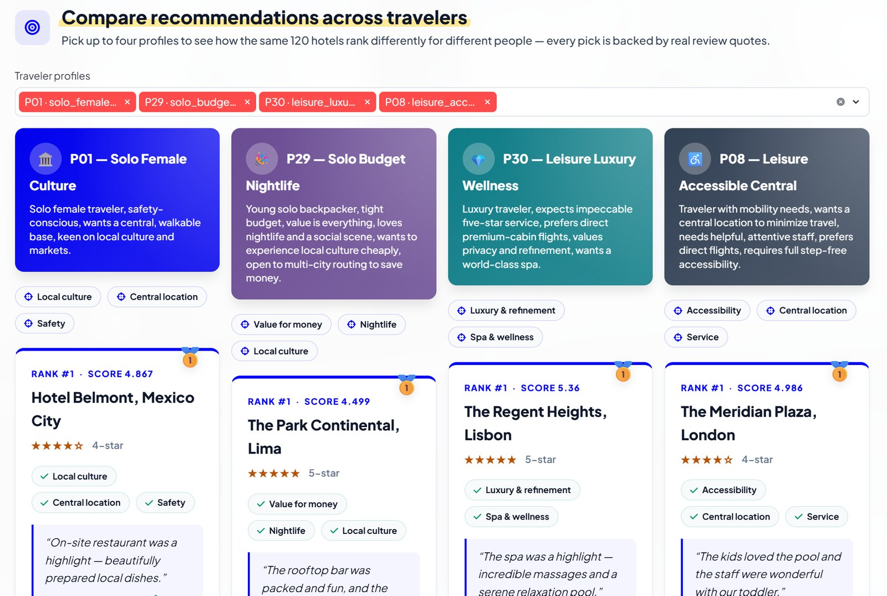
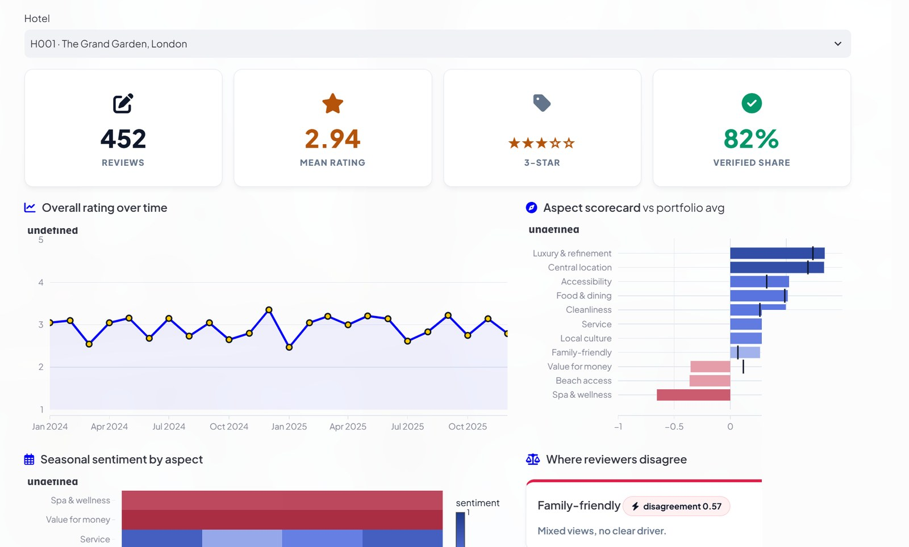
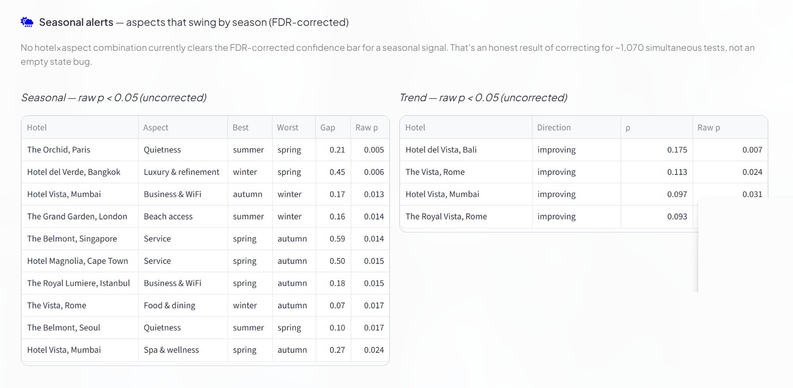
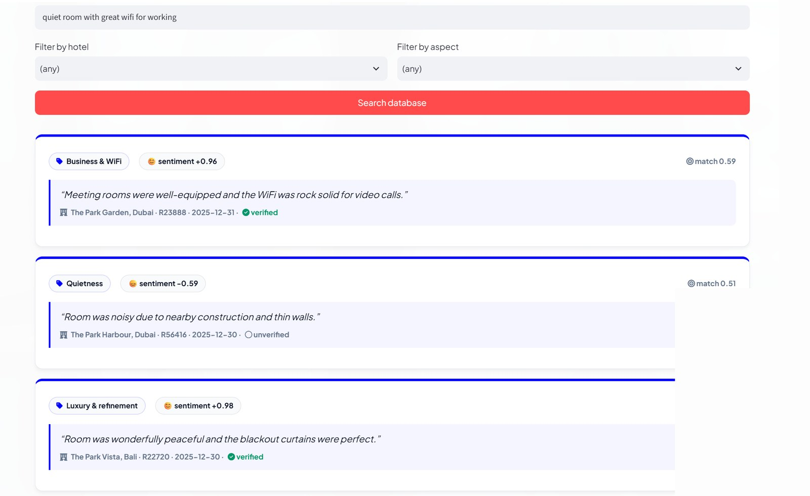

<div align="center">

# 🏨 Hotel Review Intelligence Engine

**Personalized, evidence-based hotel recommendations — built for the Expedia Group Campus Hackathon 2026**

[](https://www.python.org/)
[](https://streamlit.io/)
[](src/schema.py)
[](LICENSE)

[**🔗 Live Demo**](#) &nbsp;·&nbsp; [**📄 Solution Summary**](docs/SOLUTION_SUMMARY.md) &nbsp;·&nbsp; [**🎬 Demo Script**](DEMO_VIDEO_SCRIPT.md) &nbsp;·&nbsp; [**📋 Deck Outline**](docs/DECK_OUTLINE.md)

</div>

---

## What it does

Given any of 50 traveler profiles, the engine returns the **top-5 hotels**, each with:

- a personalized fit **score**,
- the **aspects** that matched the traveler's priorities (out of 15 tracked dimensions),
- **verbatim review quotes** as evidence — real review IDs, dates, verified badges,
- honest **caveats** — seasonal/trend drift and reviewer contradictions, only when statistically defensible.

Output conforms exactly to the provided `sample_output.json` schema, plus a richer format
that adds the evidence and justifications.

```text
Solo female, culture-seeking (P01)   →  culture / central / safety hotels, 4-star
Budget backpacker, nightlife (P29)   →  value / nightlife hotels,          5-star
Luxury wellness traveler (P30)       →  luxury / spa hotels,               5-star
```
The luxury list and the backpacker list share **zero** hotels, verified programmatically
across every pair of the four demo profiles — personalization here is structural, not cosmetic.

---

## Screenshots

| Recommendations | Hotel deep-dive |
|---|---|
|  |  |

| Portfolio pulse | Evidence search |
|---|---|
|  |  |

---

## Quick start

```bash
# 1. clone and enter the project
git clone https://github.com/<your-username>/hotel-review-intelligence.git
cd hotel-review-intelligence

# 2. install dependencies (CPU-only; no GPU required)
pip install -r requirements.txt

# 3. add the two hackathon data files to the project root
#    (hotel_reviews.json, user_profiles.json — from the official toolkit, not included
#    in this repo; see "Data" below)

# 4. build all artifacts + generate recommendations for all 50 profiles
python -m src.pipeline
#    add --polish to also LLM-rephrase the justifications (Qwen2.5-1.5B, local, optional)

# 5. launch the demo
streamlit run app.py
```

First run downloads three small open-source models (~1 GB total) and takes a couple of
minutes; every run after that is seconds, because all heavy artifacts are cached under
`data/processed/`.

> **Note:** `data/processed/` is committed to this repo on purpose (unusual for generated
> artifacts) — it's what lets the app run instantly with zero setup, including on a fresh
> [Streamlit Cloud deployment](STREAMLIT_DEPLOY.md) straight from GitHub, with no pipeline
> run required. Only re-run `python -m src.pipeline` if you've changed the pipeline code
> and want to refresh what's cached.

### Data

This repo does **not** include `hotel_reviews.json` (the raw dataset is ~19 MB and belongs
to the hackathon toolkit, not this project). Place these two files in the project root
before running the pipeline:

| File | Source |
|---|---|
| `hotel_reviews.json` | Official Hotel Review Intelligence hackathon toolkit |
| `user_profiles.json` | Official Hotel Review Intelligence hackathon toolkit (small — included here for convenience) |

---

## The demo app — 4 views

| Tab | What it shows |
|---|---|
| 🎯 **Recommendations** | Multiple traveler profiles **side-by-side** — the same 120 hotels ranked differently for each person, each pick backed by real quotes. |
| 🔍 **Hotel deep-dive** | One hotel: rating trend over time, seasonal aspect heatmap, aspect scorecard vs. the portfolio, and where reviewers disagree — with a plain-language explanation of *why*. |
| 📊 **Portfolio pulse** | The whole estate: leaderboard, fastest improving/declining hotels, FDR-corrected seasonal alerts. |
| 🔎 **Evidence search** | Free-text semantic search over the review corpus — the retrieval layer that feeds every recommendation. |

---

## How it works (architecture)

```text
hotel_reviews.json ─► ingest ─► [KEY INSIGHT] 50k reviews reduce to 87 unique
                                  template sentences → classify ONCE:
                                    • zero-shot aspects (15 dims, DeBERTa-v3)
                                    • sentiment (twitter-roberta)
                                  → 100%-audited sentence→label map
                                        │
     ┌──────────────────────────────────┼───────────────────────────────────┐
     ▼                                  ▼                                     ▼
 hotel×aspect scores            temporal analysis                    contradiction index
 recency ½-life 365d            Kruskal-Wallis (seasonal)            pos/neg split +
 verified 1.0 / unver 0.8       Spearman (trend)                     segment resolution
 traveler-type conditioning     Benjamini-Hochberg FDR               (verified / type)
 empirical-Bayes shrinkage      confidence tiers
     └──────────────────────────────────┬───────────────────────────────────┘
                                        ▼
user_profiles.json ─► profile parser ─► deterministic recommender
  (keyword rules + MiniLM backstop)      composite score → top-5 + evidence + caveats
                                        → Pydantic-validated JSON (sample schema + rich)
                                        → Streamlit app (reads cached artifacts, instant)
```

**Design stance:** the ranking is **deterministic arithmetic** — same input, same output,
every run. AI is used for *perception* (aspect tagging, sentiment, profile understanding,
semantic retrieval); arithmetic is used for *ranking*. The optional LLM pass only rephrases
justifications built from real numbers and can never change a ranking or invent a fact.

### An honest finding worth knowing about

After correcting for testing ~1,070 hotel×aspect combinations simultaneously
(Benjamini-Hochberg FDR), **no hotel currently clears the confidence bar for a statistically
defensible seasonal or trend signal** in this dataset snapshot. That's not a bug — it's the
correction working as intended. The corpus-wide correlation between review date and rating
is 0.0099 (effectively zero), so this is the mathematically correct answer, not an empty
feature. The app shows this honestly rather than manufacturing a false pattern; see
`docs/LIMITATIONS.md` for the full writeup.

---

## Output schema

Every recommendation validates against a Pydantic contract (`src/schema.py`) before it can
reach a file or the app — a malformed output can never ship. Two shapes:

- **`SubmissionOutput`** — byte-for-byte the structure of the provided `sample_output.json`.
- **`RichOutput`** — the same ranking plus evidence, matched aspects, justification, and
  caveats, used to power the app.

```json
{
  "rank": 1,
  "hotel_id": "H095",
  "hotel_name": "Hotel Belmont, Mexico City",
  "hotel_category": "4-star",
  "score": 4.867,
  "matched_aspects": ["local_culture", "location_central", "safety"],
  "justification": "Hotel Belmont ranks #1 for this traveler on local culture (+0.86)...",
  "supporting_evidence": [
    {"review_id": "R48779", "quote": "On-site restaurant was a highlight...", "verified": true}
  ]
}
```

---

## Repository layout

```text
src/
  config.py       every tunable constant, with rationale
  taxonomy.py     the 15 aspect dimensions
  ingest.py       load/validate/clean, sentence-split, dedupe to 87 uniques
  classify.py     zero-shot aspects + sentiment over the 87 sentences (+ audited overrides)
  scoring.py      hotel×aspect scores (recency, trust, traveler-type, shrinkage)
  temporal.py     seasonal + trend drift (FDR), contradiction index
  profiles.py     profile text → dims, weights, budget, traveler type, archetype
  retrieval.py    semantic search over the 87-sentence embedding index
  recommend.py    deterministic ranking + evidence + caveats
  narrate.py      optional local-LLM prose polish (validated, template fallback)
  schema.py       Pydantic output contracts (submission + rich)
  pipeline.py     python -m src.pipeline  → runs everything, caches artifacts
  appdata.py      app data-access layer (cached loaders)
  theme.py        chart + UI color system
app.py            Streamlit demo (4 tabs)
data/
  sentence_overrides.csv   manual audit corrections for the 87-sentence label set
  processed/               cached pipeline artifacts (gitignored — regenerated by pipeline)
outputs/
  rich/           per-profile evidence-carrying JSON (all 50 profiles)
  submission/     per-profile JSON matching the exact required sample_output.json schema
docs/
  SOLUTION_SUMMARY.md   problem, users, solution, impact (hackathon deliverable)
  DECK_OUTLINE.md       8-slide deck outline + demo video script source
  ASSUMPTIONS.md        10 documented, reasoned assumptions
  LIMITATIONS.md        honest scope boundaries + future work
  screenshots/          app screenshots used in this README
DEMO_VIDEO_SCRIPT.md   locked, timed, word-for-word recording script
sample_output.json     the schema this project's output is validated against
```

---

## Tech stack

Python · pandas / NumPy · Hugging Face Transformers (DeBERTa-v3 zero-shot, RoBERTa
sentiment) · sentence-transformers (semantic search) · SciPy / statsmodels (Kruskal-Wallis,
Spearman, Benjamini-Hochberg FDR) · Pydantic (schema validation) · Streamlit + Plotly
(dashboard).

---

## Docs

- [`docs/SOLUTION_SUMMARY.md`](docs/SOLUTION_SUMMARY.md) — problem, users, solution, impact
- [`docs/ASSUMPTIONS.md`](docs/ASSUMPTIONS.md) — 10 documented, reasoned assumptions
- [`docs/LIMITATIONS.md`](docs/LIMITATIONS.md) — honest scope boundaries + future work
- [`docs/DECK_OUTLINE.md`](docs/DECK_OUTLINE.md) — presentation deck outline
- [`DEMO_VIDEO_SCRIPT.md`](DEMO_VIDEO_SCRIPT.md) — locked demo recording script
- [`GITHUB_SETUP.md`](GITHUB_SETUP.md) — pushing this project to GitHub
- [`STREAMLIT_DEPLOY.md`](STREAMLIT_DEPLOY.md) — deploying straight from GitHub to a public Streamlit Cloud URL

## License

MIT — see [`LICENSE`](LICENSE).
